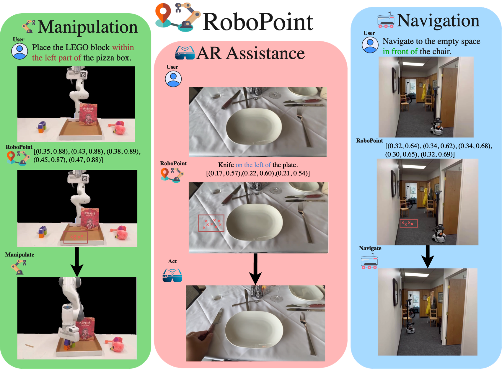
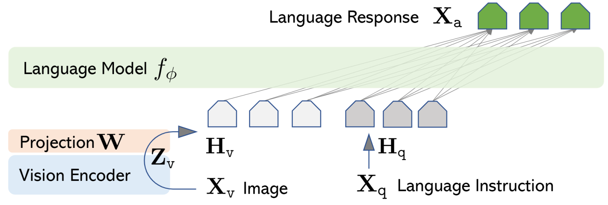
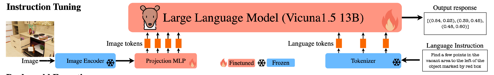
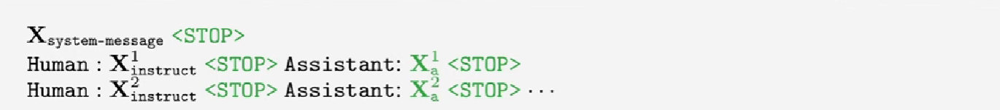
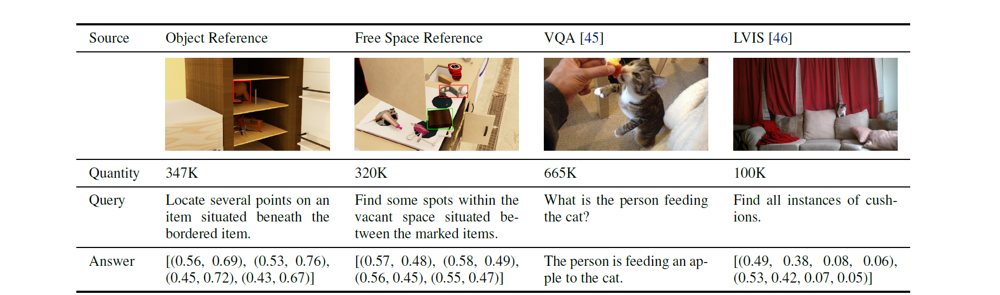
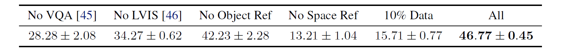
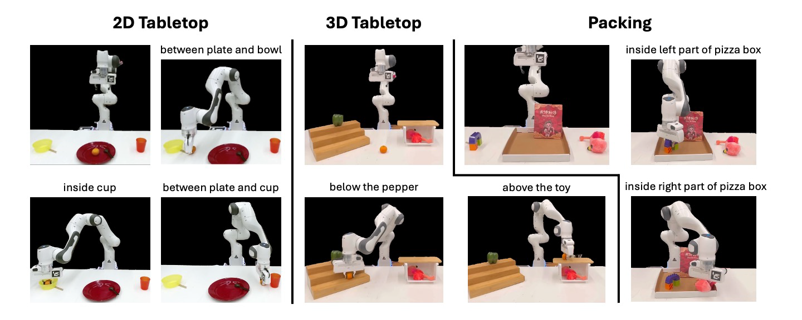
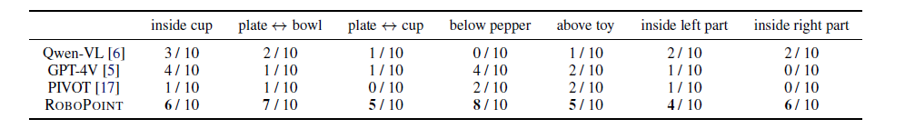
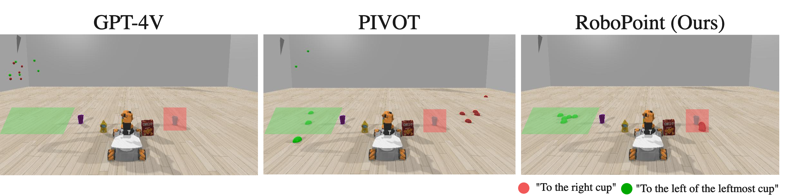

### RoboPoint: A Vision-Language Model for Robotics
<div style="display: flex; align-items: center; justify-content: space-between;">
  <div style="flex: 1; padding-right: 10px;">
    
  </div>
  <div style="flex: 2; padding-left: 10px;">
    <ul>
      <li>For embodied tasks, robots need to precisely understand <strong>spacial relationships</strong> of the objects and <strong>physical constrants</strong> from visual and language instructions.
      <li>Inspired by human behavior, we choose <strong>points</strong> for spatial relationship representation.</li>
      <li>Fine-tune <strong>multimodal foundation model</strong> (have strong priori and knowledge) at <strong>affordance points prediction task</strong> for downstream tasks like Manipulation, AR, Navigation.
    </ul>
  </div>
</div>

{style="width: 78%; height: auto;"}

---
### Related Work
#### Vision-Language Models
- CLIP, DALL-E, Flamingo
- LLaVA, GPT-4V, Gemini
#### Robotics and VLMs
- RT-1, RT-2
- PaLM-E
- VoxPoser
- SayCan
  
---
### Problem Formulation  $\mathbf{Y} = \mathcal{f}(\mathbf{X} | \theta)$
- Spatial Affordance Prediction 
  - Input $\mathbf{X}$: A tuple of an image $\mathbf{X}_v$ and an instruction prompt $\mathbf{X}_q$, $\mathbf{X}_q$  indicates some spatial relationship and physical constraints from the image.
  - Output $\mathbf{Y}$: A set of target point coordinates $\{(x_0, y_0), (x_1, y_1), \cdots, (x_n, y_n)\}$.
- Advantages
  - More precise and can be directly converted to actions.
  - General enough to enable various robotic tasks. 
---
### LLaVA1.5 Architecture
{style="width: 60%; height: auto;"}
$$
\mathbf{X}_a = \mathcal{f}_{\Phi}\{\text{concat}[\mathbf{W}\circ\mathbf{Z}_v(\mathbf{X}_v), \text{tokenize}(\mathbf{X}_q)]\}
$$
- Training: 2 stage instruction tuning
  - Visual encoder ($\mathbf{Z}_v$) and LM ($\mathcal{f}_{\phi}$) frozen, update <span style="color:red">MLP Projector ($\mathbf{W}$)</span> $\to$ **feature alignment**
  - end2end: Visual encoder ($\mathbf{Z}_v$) frozen, update both the <span style="color:red">MLP Projector ($\mathbf{W}$)</span> and  <span style="color:red">LM $\mathcal{f}_{\Phi}$</span> $\to$ **fine tune**

---
### Pipeline
{style="width: 100%; height: 70%;"}
- **Finetune**: Vicuna + MLP Projector  **Frozen**: CLIP Vision Encoder + Text Tokenizer
```python
# self.vision_tower = CLIPVisionTower(vision_tower, args)
# self.mm_projector = MultimodalProjector(vision_hidden_size, language_hidden_size)
def prepare_inputs_for_multimodal(self, input_ids, images):
    image_features = self.vision_tower(images)
    projected_features = self.mm_projector(image_features)
    text_embeddings = self.embed_tokens(input_ids)
    inputs_embeds = replace_image_tokens_with_features(text_embeddings, projected_features, input_ids)
    return inputs_embeds
```
---
### Methods: Instruction Tuning
{style="width: 60%; height: 70%;"}
- Predict the response tokens and a special token delineating the boundary between instruction.
- Autogressively training on generated ground truth (Instruction, Output) pairs.
```python
def _mask_targets(target, tokenized_lens, speakers):
    cur_idx = tokenized_lens[0]
    tokenized_lens = tokenized_lens[1:]
    target[:cur_idx] = IGNORE_INDEX  # system input no loss
    for tokenized_len, speaker in zip(tokenized_lens, speakers):
        if speaker == "human":  # Human input no loss
            target[cur_idx+2:cur_idx + tokenized_len] = IGNORE_INDEX
        cur_idx += tokenized_len
```
---
### Co-finetuning with Synthetic Data
{style="width: 80%; height: 70%;"}
  - Ensures the model does not forget the knowledge it has learned during pre-training. 
{style="width: 80%; height: 70%;"}
- Providing the appropriate mix of data is crucial to the model’s performance on downstream tasks. (Supported by data composition ablation experiments)
---
### Dataset
- Procedurally randomizing scene layouts, objects, and
camera viewpoints
- Objects are sampled from a large repository.
- Generating Affordance in Free Space
  - compute relations
  - remove the target object
  - sample points inside the intersection
- Visual prompt
---
### Downstream Tasks
- Manipulation
- AR
- Navigation

---

### Manipulation
- Language-conditioned manipulation tasks to measure ROBOPOINT’s capability on real robot.
{style="width: 60%; height: 70%;"}
- Outperforms the best baseline by 39.5% on average success rate, which depends critically on the alignment between the point predictions and the language.
{style="width: 80%; height: 70%;"}

---

### Navigation
- Predicts accurate goal point based on language, outperforms GPT-4V and PIVOT
{style="width: 80%; height: 70%;"}

### AR
- Predicts accurate goal point while give user language guidance